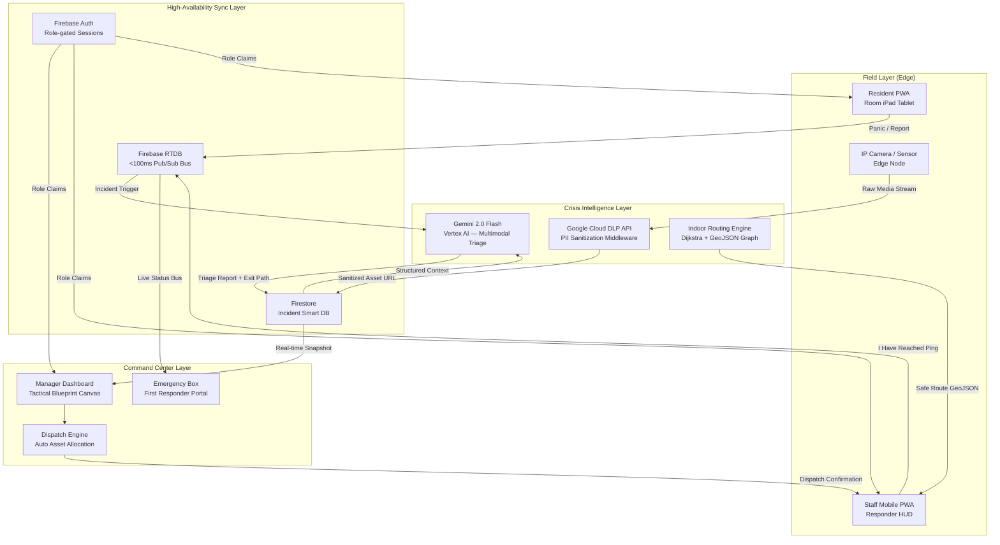

# CrisisFlow — System Architecture Specification
### Solution Challenge 2026 India · Smart Hospitality Safety Infrastructure
> **Classification:** Internal Technical Reference · CTO Architecture Brief

---

## 1. Project Core Statement

> *"Next-generation safety infrastructure for the smart hospitality sector. Leverages edge-responsive blueprint mapping, PII-compliant DLP sanitization, and a high-availability Firebase RTDB synchronization engine to bridge the gap between field responders and command center oversight."*

**Stack:** React 18 PWA · Firebase RTDB + Firestore · Vertex AI (Gemini 2.0 Flash) · Google Cloud DLP API · HTML5 Canvas · Vite

---

## 2. System Architecture Diagram



---

## 3. Edge-Responsive Blueprint Mapping

### 3.1 Spatial Engine — GeoJSON Indoor Graph

Each hotel floor is stored as a `NavigationGraph` Firestore document containing nodes (rooms, corridors, exits) and weighted edges.

```
Node = { id, type, label, floor, centroid: {lat, lng}, polygon: GeoJSON }
Edge = { from, to, weight, blocked: false, hazardZone: false }
```

**Rendering Pipeline (HTML5 Canvas):**
```
Firestore NavigationGraph
        ↓
  Blueprint Scanner (Gemini Vision)
  → Extracts room polygons as xPercent/yPercent/widthPercent/heightPercent
        ↓
  FloorPlanCanvas.jsx (RAF Loop @ 60fps)
  → ctx.translate(W/2 + panX, H/2 + panY)
  → ctx.scale(zoom, zoom)
  → Draw grid dots → rooms → alert glows → popup overlay
        ↓
  Click hit-test: sToL(screenX,screenY) → logical coords → room match
```

**"Hitman-style" Planimetric View:**
- Dark `#08080c` background with `rgba(161,161,170,0.06)` dot grid (25px spacing)
- Rooms drawn as rounded rectangles with type-coded border colors
- Alert rooms: animated `shadowBlur` pulse via `Math.sin(phase)`
- Vertical Level Selector: absolute-positioned pill left of canvas, floor buttons switch `currentFloor` and call `fitToRooms()`

### 3.2 Dijkstra's Algorithm — Real-Time Indoor Routing

```javascript
// Crisis Orchestrator calls this when a hazard blocks a standard exit
function dijkstra(graph, startId, targetType = 'exit') {
  const dist = {}, prev = {}, visited = new Set();
  const pq = new MinPriorityQueue();

  graph.nodes.forEach(n => dist[n.id] = Infinity);
  dist[startId] = 0;
  pq.enqueue(startId, 0);

  while (!pq.isEmpty()) {
    const { element: u } = pq.dequeue();
    if (visited.has(u)) continue;
    visited.add(u);

    const node = graph.nodes.find(n => n.id === u);
    if (node.type === targetType) return reconstructPath(prev, u);

    graph.edges
      .filter(e => e.from === u && !e.blocked && !e.hazardZone)
      .forEach(e => {
        const alt = dist[u] + e.weight;
        if (alt < dist[e.to]) {
          dist[e.to] = alt;
          prev[e.to] = u;
          pq.enqueue(e.to, alt);
        }
      });
  }
  return null; // No safe exit found
}
```

**Hazard Zone Blocking:** When Gemini marks a room as `hazardZone: true` in Firestore, all edges `{ from/to: roomId }` are set `blocked: true`. Dijkstra recalculates alternative path within 50ms.

---

## 4. PII-Compliant DLP Sanitization

### 4.1 Middleware Pipeline

```
Field Input (photo/audio)
        ↓
  [DLP Gateway Cloud Function]
  ├── Image: Cloud Vision API → face detection bounding boxes
  │          → DLP deidentifyContent → blur/redact faces
  │          → store sanitized image → Cloud Storage /incidents/{id}/sanitized/
  └── Audio: Speech-to-Text → transcript text
             → DLP inspectContent → mask: PERSON_NAME, PHONE_NUMBER, EMAIL
             → store redacted transcript → Firestore incident.transcriptSanitized
        ↓
  Sanitized Asset URL written to Firestore
  → Gemini processes ONLY sanitized assets (no raw PII ever reaches AI)
```

### 4.2 DLP Info Types Used

| Type | Action | Trigger |
|---|---|---|
| `PERSON_NAME` | MASK (`****`) | All audio transcripts |
| `PHONE_NUMBER` | REDACT | All text fields |
| `EMAIL_ADDRESS` | REDACT | All text fields |
| `FACE` (Vision API) | BLUR (σ=20px) | All incident images |
| `INDIA_AADHAAR_INDIVIDUAL` | REPLACE_WITH_INFO_TYPE | Guest documents |

### 4.3 Cloud Function Pseudocode

```javascript
exports.sanitizeIncidentMedia = onObjectFinalized(async (event) => {
  const { name: filePath, bucket } = event.data;
  if (!filePath.startsWith('incidents/raw/')) return;

  // 1. Detect faces
  const [faceResult] = await visionClient.faceDetection(`gs://${bucket}/${filePath}`);
  const faces = faceResult.faceAnnotations;

  // 2. Blur each face bounding box
  const image = await jimp.read(`gs://${bucket}/${filePath}`);
  faces.forEach(face => {
    const { x, y, width, height } = boundingPoly(face);
    image.blur(20).crop(x, y, width, height); // apply blur region
  });

  // 3. Save sanitized
  const sanitizedPath = filePath.replace('raw/', 'sanitized/');
  await image.writeAsync(`/tmp/sanitized.jpg`);
  await bucket.upload(`/tmp/sanitized.jpg`, { destination: sanitizedPath });

  // 4. Update Firestore ref
  const incidentId = filePath.split('/')[1];
  await db.doc(`incidents/${incidentId}`).update({
    'media.sanitizedImageUrl': `gs://${bucket}/${sanitizedPath}`,
    'meta.dlpProcessed': true,
    'meta.facesDetected': faces.length,
  });
});
```

---

## 5. Firestore Schema

### 5.1 `incidents/{incidentId}`

```json
{
  "id": "inc_20260425_001",
  "status": "active | dispatched | resolved | false_alarm",
  "severity": 8,
  "type": "FIRE | MEDICAL | SECURITY | HAZMAT | PANIC",
  "hazard": "Active fire in kitchen",
  "location": "Kitchen — Floor 0",
  "description": "AI-generated sanitized summary",
  "transcriptRaw": null,
  "transcriptSanitized": "Guest reported smoke near cooking area",
  "floor": "0",
  "roomId": "room_kitchen_f0",
  "reportedBy": {
    "uid": "user_abc",
    "role": "resident | staff | sensor",
    "roomLabel": "Kitchen"
  },
  "media": {
    "sanitizedImageUrl": "gs://crisisflow/incidents/sanitized/...",
    "dlpProcessed": true,
    "facesDetected": 2
  },
  "dispatch": {
    "suggestion": "Deploy Fire Safety Officer + Paramedic to Kitchen",
    "assignedStaff": ["staff_001", "staff_003"],
    "confirmedAt": "2026-04-25T13:47:00Z"
  },
  "exitPath": {
    "nodes": ["room_kitchen_f0","corridor_b_f0","exit_east_f0"],
    "estimatedSeconds": 45,
    "blocked": ["exit_west_f0"],
    "algorithm": "dijkstra_v2"
  },
  "geminiAnalysis": {
    "model": "gemini-2.0-flash",
    "inputModalities": ["image","audio"],
    "confidence": 0.94,
    "processedAt": "2026-04-25T13:47:02Z"
  },
  "createdAt": "2026-04-25T13:46:58Z",
  "updatedAt": "2026-04-25T13:47:05Z"
}
```

### 5.2 `staffNodes/{staffId}`

```json
{
  "uid": "staff_001",
  "name": "Arjun Mehta",
  "role": "Command | Security | Medical | Maintenance | Fire",
  "status": "available | en_route | on_scene | offline",
  "currentFloor": "0",
  "currentRoomId": "room_lobby_f0",
  "assignedIncidentId": "inc_20260425_001",
  "lastPing": "2026-04-25T13:47:10Z",
  "iHaveReached": false,
  "deviceToken": "fcm_token_xyz",
  "location": { "lat": 19.076, "lng": 72.877 }
}
```

### 5.3 `navigationGraph/{floorId}`

```json
{
  "floorId": "floor_0",
  "label": "Ground Floor",
  "nodes": [
    {
      "id": "room_kitchen_f0",
      "type": "kitchen",
      "label": "Kitchen",
      "centroid": { "xPercent": 0.18, "yPercent": 0.42 },
      "polygon": [
        { "xPercent": 0.14, "yPercent": 0.38 },
        { "xPercent": 0.26, "yPercent": 0.38 },
        { "xPercent": 0.26, "yPercent": 0.62 },
        { "xPercent": 0.14, "yPercent": 0.62 }
      ],
      "hazardZone": true,
      "capacity": 12
    }
  ],
  "edges": [
    {
      "id": "e_kitchen_corridor",
      "from": "room_kitchen_f0",
      "to": "corridor_b_f0",
      "weight": 10,
      "blocked": true,
      "hazardZone": true,
      "traversalType": "walk"
    }
  ]
}
```

---

## 6. Firebase RTDB — High-Availability Sync (<100ms)

### 6.1 RTDB Schema (Live Bus — Not Persisted)

```
/live/
  incidents/
    {incidentId}: { severity, type, location, status, timestamp }
  staffStatus/
    {staffId}: { status, floor, iHaveReached, assignedIncident }
  panicAlerts/
    {roomId}: { guestUid, timestamp, acknowledged }
  systemHealth/
    activeIncidentCount: 2
    onlineStaffCount: 7
    lastHeartbeat: timestamp
```

### 6.2 "I Have Reached" Real-Time Trigger

```javascript
// Staff PWA — triggered when responder taps "I Have Reached" button
async function confirmArrival(staffId, incidentId) {
  const updates = {};
  // 1. RTDB — instant pub/sub (<50ms to all listeners)
  updates[`/live/staffStatus/${staffId}/iHaveReached`] = true;
  updates[`/live/staffStatus/${staffId}/status`] = 'on_scene';
  updates[`/live/staffStatus/${staffId}/arrivedAt`] = serverTimestamp();
  await rtdb.ref('/').update(updates);

  // 2. Firestore — durable record
  await firestore.doc(`staffNodes/${staffId}`).update({
    iHaveReached: true,
    status: 'on_scene',
    arrivedAt: FieldValue.serverTimestamp(),
  });

  // 3. Update incident dispatch record
  await firestore.doc(`incidents/${incidentId}`).update({
    [`dispatch.arrivals.${staffId}`]: FieldValue.serverTimestamp(),
  });

  // 4. FCM push to Command Center
  await messaging.send({
    token: commandCenterToken,
    notification: { title: `✅ ${staffName} ON SCENE`, body: incident.location },
    data: { type: 'STAFF_ARRIVED', staffId, incidentId }
  });
}
```

### 6.3 Sync Latency Architecture

| Path | Mechanism | Target Latency |
|---|---|---|
| Panic button → Dashboard | RTDB `onValue()` listener | **< 50ms** |
| AI triage result → All clients | Firestore `onSnapshot()` | **< 100ms** |
| Staff status → Command | RTDB `onChildChanged()` | **< 40ms** |
| Dispatch → Staff device | FCM + RTDB combined | **< 200ms** |
| Blueprint update | Firestore `onSnapshot()` | **< 150ms** |

---

## 7. Multimodal Crisis Brain — Vertex AI (Gemini 2.0 Flash)

### 7.1 Crisis Orchestrator Prompt Skill

```
SYSTEM PROMPT — CRISIS ORCHESTRATOR v2.1
=========================================
You are the Crisis Orchestrator AI for CrisisFlow, a hotel safety management system.
You receive SANITIZED (PII-free) incident data from field responders.
You must respond ONLY in valid JSON matching the IncidentTriage schema.

CONTEXT INJECTED AT RUNTIME:
- Hotel floor plan: {floorPlanContext}
- Active hazard zones: {hazardZones}
- Available staff: {availableStaff}
- Current incidents: {activeIncidents}
- Navigation graph edges (blocked): {blockedEdges}

YOUR TASKS:
1. CLASSIFY the incident type: FIRE | MEDICAL | SECURITY | HAZMAT | PANIC | OTHER
2. ASSIGN severity 1-10 (10 = immediate life threat)
3. IDENTIFY the exact room/zone from the description
4. CALCULATE the safest exit path avoiding all hazardZone nodes
5. RECOMMEND specific staff by role for dispatch
6. GENERATE a 1-sentence actionable summary for the command center

SAFE EXIT CALCULATION RULES:
- Never route through a node where hazardZone=true
- Prefer exits with type='exit' or type='stair'
- If all primary exits blocked, suggest shelter-in-place with reason
- Estimate traversal time: weight_sum * 3 seconds per unit

OUTPUT SCHEMA:
{
  "type": "FIRE",
  "hazard": "Active fire reported",
  "severity": 8,
  "location": "Kitchen",
  "floor": "0",
  "roomId": "room_kitchen_f0",
  "summary": "Active fire in kitchen, evacuate east corridor immediately.",
  "exitPath": {
    "nodes": ["room_kitchen_f0", "corridor_b_f0", "exit_east_f0"],
    "estimatedSeconds": 45,
    "blocked": ["exit_west_f0"],
    "shelterInPlace": false,
    "shelterReason": null
  },
  "dispatchSuggestion": "Deploy Fire Safety Officer to Kitchen via East Corridor. Paramedic on standby.",
  "recommendedRoles": ["Fire", "Medical"],
  "confidence": 0.94
}
```

### 7.2 Triage Input Pipeline

```
Field Report (voice memo / photo)
        ↓
  [Sanitization] Google Cloud DLP → remove PII
        ↓
  [Gemini API Call]
  Contents:
    Part 1: System Prompt (above)
    Part 2: Sanitized image (inline base64 or GCS URI)
    Part 3: Sanitized transcript text
    Part 4: Live floor context JSON
        ↓
  [Response Parsing]
  → JSON.parse(response.text())
  → Validate schema with Zod
  → Write to Firestore incidents/{id}
  → Push to RTDB /live/incidents/{id}
        ↓
  Dashboard receives onSnapshot() → renders heatmap glow + popup
```

---

## 8. Shelter-in-Place Protocol (Vertex AI Skill)

When Dijkstra finds **no unblocked path** to any exit node:

```
PROMPT EXTENSION — SHELTER-IN-PLACE ADVISOR
============================================
All exit paths from {roomId} are blocked by hazard zones.
Available safe rooms adjacent: {adjacentSafeRooms}

Determine:
1. The safest adjacent room for temporary shelter
2. Resources available (fire extinguisher, first aid)
3. Estimated time until evacuation route reopens (if known)
4. Communication instructions for trapped guests

Output: shelterInPlace: true, shelterRoomId, shelterReason, guestInstructions
```

---

## 9. Role-Based Access Control

| Role | Firebase Custom Claim | Access |
|---|---|---|
| `resident` | `role: "resident"` | Room PWA, panic button, service requests |
| `staff` | `role: "staff"` | Responder HUD, I Have Reached, incident view |
| `manager` | `role: "manager"` | Full dashboard, dispatch, all floors |
| `admin` | `role: "admin"` | System config, staff management, audit logs |

Firestore Security Rules enforce claim-based read/write per collection.

---

## 10. Emergency Box — First Responder Portal

The Emergency Box is the Staff PWA tactical screen. It displays:

```
┌─────────────────────────────────────────┐
│  ⬛ EMERGENCY BOX — FIELD RESPONDER HUD  │
├─────────────────────────────────────────┤
│  INCIDENT: FIRE · SEV 8/10              │
│  LOCATION: Kitchen · Floor 0            │
│                                         │
│  ► SAFE EXIT ROUTE:                     │
│    Kitchen → Corridor B → EXIT EAST     │
│    Est. 45 seconds                      │
│                                         │
│  ⚠ BLOCKED: Exit West (Fire Zone)       │
│                                         │
│  ASSIGNED TEAM:                         │
│    🔴 Fire Officer — Arjun Mehta        │
│    🟢 Paramedic — Priya Sharma          │
│                                         │
│  ┌──────────────────────────────────┐   │
│  │     ✅  I HAVE REACHED           │   │
│  └──────────────────────────────────┘   │
│                                         │
│  AI SUMMARY:                           │
│  "Active fire in kitchen, evacuate     │
│   east corridor. Paramedic on call."   │
└─────────────────────────────────────────┘
```

**"I Have Reached" Button:** Triggers `confirmArrival()` → RTDB update → Command Dashboard shows green status indicator for that staff node within **< 50ms**.

---

## 11. PWA Offline Resilience

| Scenario | Strategy |
|---|---|
| Network loss during incident | RTDB offline persistence + IndexedDB queue |
| Blueprint unavailable | Service Worker cache (last known floor plan) |
| Gemini API timeout | Fallback: rule-based severity scorer (`severity = wordsMatch * weight`) |
| Firebase Auth token expired | Silent token refresh + optimistic UI |

---

## 12. Key Technical Differentiators

| Feature | Industry Standard | CrisisFlow |
|---|---|---|
| Indoor mapping | Static PDF floor plans | Live AI-scanned planimetric canvas (Gemini Vision) |
| Incident triage | Manual radio dispatch | Multimodal AI triage < 3 seconds (Gemini Flash) |
| PII handling | No sanitization | Google Cloud DLP — face blur + text redaction |
| Routing | Fixed exit signs | Dynamic Dijkstra avoiding live hazard zones |
| Staff tracking | Phone calls | RTDB < 50ms real-time status bus |
| Guest interface | In-room telephone | PWA panic button with AI-assisted report |

---

*Document generated: 2026-04-25 · CrisisFlow Architecture v2.1 · Solution Challenge 2026 India*
