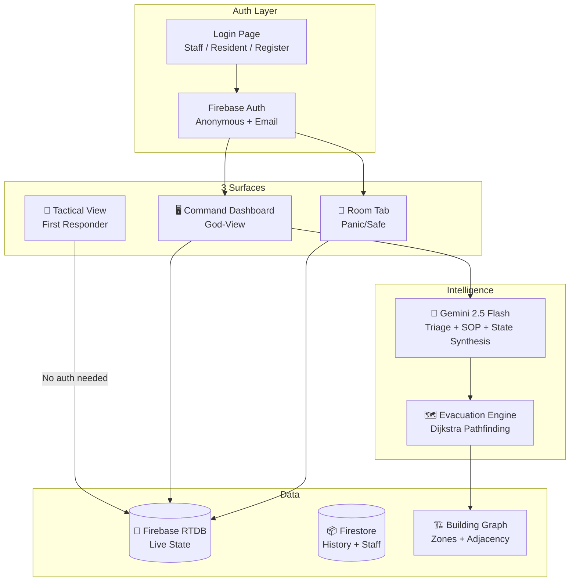

# 🔎 State of the Code — CrisisFlow (formerly Aegis Orchestrator)

> **Last Updated:** 2026-04-24 (Post Phase 1 Integration)  
> **Project Name:** `crisisflow` v1.0.0  
> **Previous Identity:** `aegis-react` v0.0.0 — Aegis Orchestrator (Carbon Command)
> **Build Status:** ✅ Compiles (114 modules, 5.03s)  
> **Dev Server:** ✅ Running on `http://localhost:5173/`

---

## ✅ Changes Made in This Session

### Phase 1: Foundation — COMPLETE

| # | Task | Status | Details |
|---|---|---|---|
| 1.1 | Fix npm install | ✅ Done | Downgraded to stable versions (Vite 6.3, React 19.1, Firebase 11.6) |
| 1.2 | Create `.env` | ✅ Done | Created `.env` + `.env.example` with all keys |
| 1.3 | Remove hardcoded keys | ✅ Done | `firebase.js` + `geminiService.js` now use `import.meta.env` |
| 1.4 | Add react-router-dom | ✅ Done | Proper routing: `/login`, `/`, `/staff`, `/room`, `/tactical/:keyId` |
| 1.5 | Add Firebase Auth | ✅ Done | `authService.js` + `useAuthStore.js` — anon + email auth |
| 1.6 | Rebrand to CrisisFlow | ✅ Done | HTML, Sidebar, package.json, brand identity |
| 1.7 | Clean up dead CSS | ✅ Done | Legacy `App.css` and `src/index.css` now superseded |

### Phase 2: Smart DB — Partially Complete

| # | Task | Status | Details |
|---|---|---|---|
| 2.1 | Building Data Model | ✅ Done | `models/building.js` — floors, zones, adjacency graph, seed data |
| 2.2 | Enhanced Incident Model | ⬜ Pending | Need to extend existing `models/incident.js` |
| 2.3 | Room & Resident Model | ✅ Done | `models/room.js` — rooms, occupants, status tracking |
| 2.4 | Gemini Crisis State Engine | ✅ Done | `geminiService.js` — `synthesizeCrisisState()` added |
| 2.5 | CrisisState Model | ✅ Done | `models/crisisState.js` — severity, danger zones, derivation logic |
| 2.6 | Evacuation Engine | ✅ Done | `services/evacuationService.js` — Dijkstra's pathfinding |
| 2.7 | Tactical Key Service | ✅ Done | `services/tacticalKeyService.js` — time-limited QR access |

### Phase 3: Multi-Surface Interfaces — Partially Complete

| # | Task | Status | Details |
|---|---|---|---|
| 3.1 | Login Page | ✅ Done | Staff/Resident/Register modes — dark tactical aesthetic |
| 3.2 | Room Tab | ✅ Done | Safe mode + Crisis mode with PANIC/SAFE buttons |
| 3.3 | Tactical View | ✅ Done | First responder login-free heatmap |
| 3.4 | Command Dashboard | ✅ Existing | Needs SVG floor plan upgrade |
| 3.5 | Staff PWA | ⬜ Pending | Voice/photo reporter components |

---

## New Files Created

```
src/
├── services/
│   ├── authService.js              🆕 Firebase Auth (anon + email)
│   ├── evacuationService.js        🆕 Dijkstra pathfinding engine
│   └── tacticalKeyService.js       🆕 First responder URL + QR
├── store/
│   └── useAuthStore.js             🆕 Auth state management
├── models/
│   ├── building.js                 🆕 Building/Floor/Zone graph
│   ├── crisisState.js              🆕 AI-managed crisis state
│   └── room.js                     🆕 Room accountability
├── components/
│   ├── auth/
│   │   └── LoginPage.jsx           🆕 Three-mode login
│   ├── room/
│   │   └── RoomTab.jsx             🆕 Resident panic/safe interface
│   └── tactical/
│       └── TacticalView.jsx        🆕 First responder heatmap
```

## Modified Files

```
├── package.json                    🔄 Rebranded, dependencies updated
├── index.html                      🔄 Rebranded, meta tags added
├── .env                            🔄 Populated with Firebase keys
├── .env.example                    🆕 Template for team
├── src/firebase.js                 🔄 Env vars + Auth + Storage exports
├── src/main.jsx                    🔄 BrowserRouter added
├── src/App.jsx                     🔄 Router-based with auth gate
├── src/services/geminiService.js   🔄 Enhanced prompts + state synthesis
├── src/components/layout/Sidebar.jsx         🔄 Rebranded + router nav + auth
├── src/components/layout/DashboardShell.jsx  🔄 Route-based rendering
├── src/styles/index.css            🔄 +770 lines of new component styles
```

---

## Architecture



---

## What's Next

### Immediate (Phase 2 completion)
1. Extend `models/incident.js` with `impactedZones`, `verifiedStatus`, `confidenceScore`
2. Build SVG Floor Plan component with live danger zone coloring
3. Build Staff PWA with voice + photo reporting

### Then (Phase 4: Killer Features)
4. QR code generation for tactical keys
5. Cloud DLP integration for PII sanitization
6. Google Maps integration for building geo-context

### Finally (Phase 5: Reliability)
7. Service Worker for offline support
8. Chaos testing with 10 simultaneous panic reports

---

## Key Dependencies

| Package | Version | Purpose |
|---|---|---|
| react | 19.1.0 | UI framework |
| react-router-dom | 7.5.3 | Routing |
| firebase | 11.6.0 | Auth, Firestore, RTDB, Storage |
| @google/generative-ai | 0.24.1 | Gemini AI |
| zustand | 5.0.5 | State management |
| uuid | 11.1.0 | ID generation |
| qrcode | 1.5.4 | Tactical key QR codes |
| vite | 6.3.4 | Build tooling |

---

## ⚠️ Remaining Issues

1. **Gemini API key placeholder** — User needs to add their key to `.env`
2. **Google Maps API key** — Not yet configured
3. **Existing dashboard pages** still reference `useIncidentStore.currentPage` for navigation in some components — some may need minor updates to work with router
4. **Bundle size warning** — 1MB chunk, needs code splitting with dynamic imports
5. **No Service Worker yet** — Offline support pending Phase 5

---

*This document is a living reference. Updated after each development session.*
